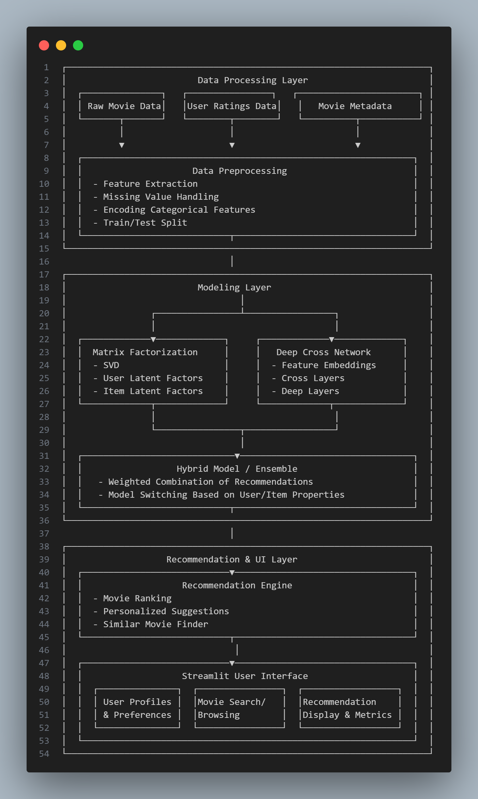
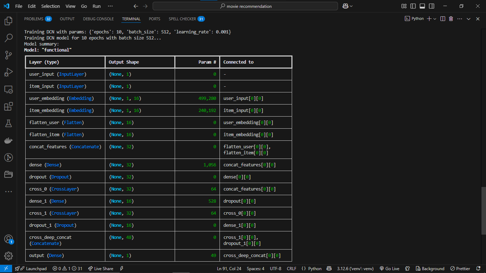

# Movie-Recommendation-With-Hybrid-Models

A hybrid recommendation system combining matrix factorization and deep learning techniques to provide personalized movie suggestions.

## Table of Contents

- [Features](#features)
- [Architecture](#architecture)
- [Installation](#installation)
- [Usage](#usage)
- [Dataset](#dataset)
- [Training Models](#training-models)
- [License](#license)

## Features ✨

- **Hybrid Recommendation Engine**  
  - Matrix Factorization (SVD) for latent features
  - Deep Cross Network for nonlinear feature interactions
- **Preprocessing Pipeline**  
  - Handles missing values & categorical encoding
  - User/item feature normalization
- **Interactive Web UI**  
  - User preference profiling
  - Movie search & similarity browsing
  - Recommendation explanations
 
## Quick Start

git clone https://github.com/yourusername/movie-recommender.git
cd movie-recommender
pip install -r requirements.txt
streamlit run app/main.py
 
## Architecture 🏗️

##Installation ⚙️

# Clone repo

git clone https://github.com/mid-works/movie-recommender.git
cd movie-recommender

# Create virtual environment (Python 3.8+ recommended)

python -m venv venv
source venv/bin/activate  # On Windows: venv\Scripts\activate

# Install dependencies

pip install -r requirements.txt

##Usage 🚀

Data Preparation
Place your datasets in data/raw/:

movies.csv - Movie metadata (title, genre, etc.)

ratings.csv - User-movie ratings

(Optional) users.csv - User demographics

Run Preprocessing
python src/data/preprocess.py

##Train Models

# Train SVD model

python models/train_svd.py

# Train DCN model

python models/train_dcn.py
Launch Web UI

streamlit run app/main.py

##Dataset 📊

We use the MovieLens 25M dataset by default. To use custom data:

Ensure CSV files contain minimum required columns:

# ratings.csv

userId,movieId,rating,timestamp

# movies.csv

movieId,title,genres

##Training Models 🧠

Configuration files in configs/ control:

-Hyperparameters for SVD/DCN

-Ensemble weights

-Feature engineering settings

-Example training output:

[2023-11-15 10:00:00] Training SVD...
RMSE: 0.8923 | Precision@10: 0.4231
[2023-11-15 10:30:00] Training DCN...
Epoch 5/50 - loss: 1.2032 - accuracy: 0.7124

##Contributing 🤝

-1.Fork the project

-2.Create your feature branch (git checkout -b feature/AmazingFeature)

-3.Commit changes (git commit -m 'Add amazing feature')

-4.Push to branch (git push origin feature/AmazingFeature)

-5.Open a Pull Request

## License 📄

Distributed under the MIT License. See `LICENSE` for details.
